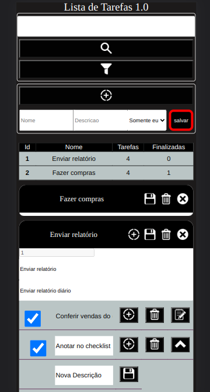
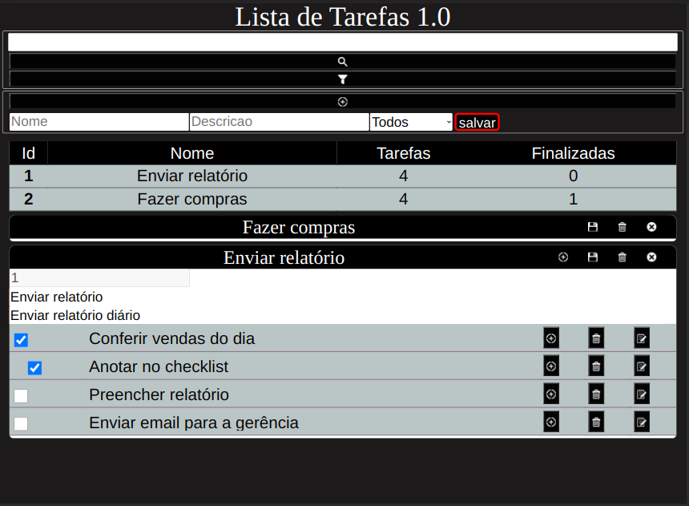

[# Lista de Tarefas - Lucas Job Viana ](https://lucasjobviana.github.io/j_worktask/)

Olá, este repósitorio é para armazenar o meu projeto worktasks, um gerênciador de lista de tarefas. Clique no link acima para acessa-lo. 

## Oque é e como funciona ?

O projeto consiste em um sistema web full-stack para gerenciar listas de tarefas. 

Foi desenvolvido para rodar em containers docker. Ao buildar/executar o docker-compose.yml na raiz do projeto, será criado três containers sem nome, utilizando as imagens j_worktask_frontend, j_worktask_backend e mysql:8.0.29. O banco mysql será criado com o nome j_worktask_db, com usuário root, porta 3306 e senha: root.
A versão de demostração do githubpages só está usando o frontend, todos os dados nessa versão estão sendo salvos no localstorage, para usar a api do backend é preciso setar o valor da variável usingBD dentro de `clientjwt/src/context/ControlPanelProvider.jsx`.

## Quais tecnologias foram utilizadas ? 

### Front-End
  - Javascript: [React - Componentes Funcionais](https://react.dev/), [React Router Dom -V5](https://v5.reactrouter.com/), [Context API](https://legacy.reactjs.org/docs/context.html).
  - Css: [Vanila 1.0](https://vanillacss.com/).
### Back-End
  - Node: [Express](https://expressjs.com/pt-br/), [Mysql2](https://www.npmjs.com/package/mysql2).
  - Banco de dados: [Mysql](https://www.mysql.com/).
  - [Docker](https://www.docker.com/).

## Tem algum pré-requisito para acessar o projeto ?

- Navegador de internet.
- Docker e docker-compose intalados na máquina.

## Como posso rodar esse projeto na minha máquina ?

    1. Clone ou fork este repositório.
    2. Navegue até o diretório do projeto: `cd nome-do-projeto`.
    3. Na raiz do projeto, execute o comando: docker-compose up --build.
    4. Acesse o front-end por `http://172.20.0.10:5173/` pelo seu navegador.

## Para acessar:
    Front-End: 172.20.0.10:5173
    Back-End: 172.20.0.11:3000
    Mysql: 172.20.0.12:3306

## Capturas

